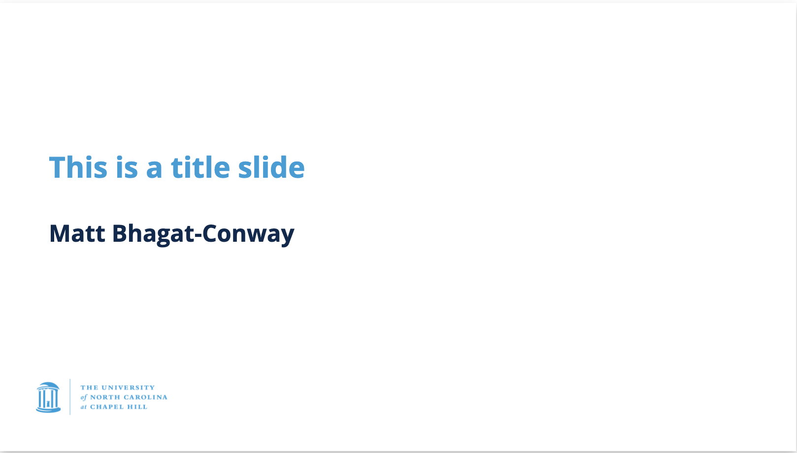

# UNC Marp theme

This is a theme for [Marp](https://marp.app) with colors and logos from the University of North Carolina at Chapel Hill. It's fairly simple; it places the UNC logo in the lower-left of each slide, styles headings in UNC colors, and compiles to tagged PDFs that are accessible to users with disabilities. It bundles the [Open Sans](https://fonts.google.com/specimen/Open+Sans) font from Google Fonts, which is a UNC-approved sans-serif font.

## Usage

Usage is fairly simple. First, in your markdown front matter, place `theme: unc`. Slides will then be styled in UNC colors with a logo.

If you wish to use a dark background, you can place `class: dark` in your front matter, or `<!-- _class: dark -->` on an individual slide. Title slides (where the header is not attached to the top of the screen) can be specified with `<!-- _class: title -->`. The UNC logo can be removed from a slide with `<!-- _class: blank -->` or all slides with `class: blank` in front matter. All of these options can be stacked, for instance `<!-- _class: dark blank -->` will produce a dark slide with no logo.

## Installation

Place unc.css somewhere, and then in your `~/.marprc.yml`, add a line `themeSet: /path/to/directory/containing/unc.css`